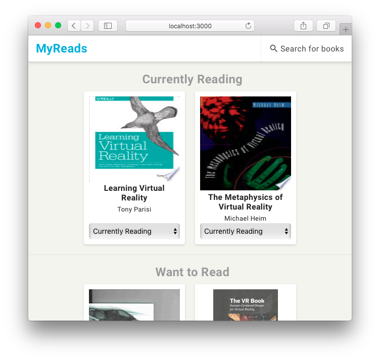

---

This project was bootstrapped with [Create React App](https://github.com/facebookincubator/create-react-app).

This project was made as a part of the [React Developer Udacity Nanodegree](https://www.udacity.com/course/react-nanodegree--nd019).

## To Run Locally

```bash
$ cd ~/Desktop
$ git clone https://github.com/griffinsockwell/reactnd-project-myreads.git
```

Make sure [Node.js](https://nodejs.org/) is installed.

Change into the correct directory.
```bash
$ cd reactnd-project-myreads
```

Install the node modules.
```bash
$ npm install
```

Start the development server.
```bash
$ npm start
```
